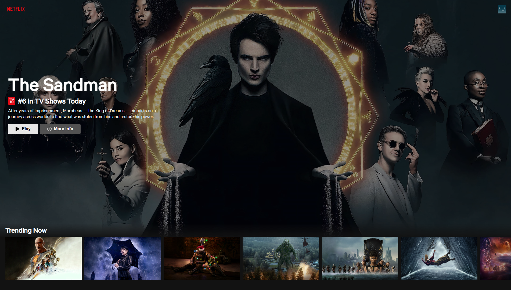

# Netflix Clone

[](https://opensource.org/licenses/MIT) 

[](https://netflix-clone-e2d22.web.app/)


## Description

This is a work-in-progress application that I am working on that attempts to mimic Netflix's UI. This application will not host any videos, although I may try to link each show/movie to an external video hosting website toward the end of development. I am creating this app to work on some of my front-end skills, and I am having a lot of fun with it so far. This application is powered using the [The Movie Database API](https://developers.themoviedb.org/3/getting-started/introduction), and hosted using [Firebase](https://firebase.google.com/). You can access this (WIP) application [here](https://netflix-clone-e2d22.web.app/).

## Table of Contents

1. [Installation](#installation)
2. [Usage](#usage)
3. [Screenshots](#screenshots)
4. [License](#license)
5. [Acknowledgements](#acknowledgements)
6. [Contact](#contact)

## <a id="installation"></a>Installation

You can run this application on your local machine by cloning this repo.

Once cloned, navigate to the project directory and install dependencies using your package manager of choice.

## <a id="usage"></a>Usage

Usage of this application on a local machine requires a The Movie Database API key. To obtain a key, head over to [The Movie Database](https://www.themoviedb.org/), sign up for an account, and register for a free API key.

Once you have your key, navigate to the ```sample.env``` file in the root directory, and replace ```<your TMDB API key>``` with your TMDB API key. Then, rename ```sample.env``` to ```.env```.

Start the server by entering the ```start``` command in the terminal. By default, the development server starts on http://localhost:3000.

## <a id="screenshots"></a> Screenshots



## <a id="license"></a>License

This application is covered under the [MIT](https://opensource.org/licenses/MIT) license

----------------------------------------------------------------

  Copyright © 2022 Richard Zhang

  Permission is hereby granted, free of charge, to any person obtaining a copy of this software and associated documentation files (the "Software"), to deal in the Software without restriction, including without limitation the rights to use, copy, modify, merge, publish, distribute, sublicense, and/or sell copies of the Software, and to permit persons to whom the Software is furnished to do so, subject to the following conditions:
  
  The above copyright notice and this permission notice shall be included in all copies or substantial portions of the Software.
  
  THE SOFTWARE IS PROVIDED "AS IS", WITHOUT WARRANTY OF ANY KIND, EXPRESS OR IMPLIED, INCLUDING BUT NOT LIMITED TO THE WARRANTIES OF MERCHANTABILITY, FITNESS FOR A PARTICULAR PURPOSE AND NONINFRINGEMENT. IN NO EVENT SHALL THE AUTHORS OR COPYRIGHT HOLDERS BE LIABLE FOR ANY CLAIM, DAMAGES OR OTHER LIABILITY, WHETHER IN AN ACTION OF CONTRACT, TORT OR OTHERWISE, ARISING FROM, OUT OF OR IN CONNECTION WITH THE SOFTWARE OR THE USE OR OTHER DEALINGS IN THE SOFTWARE.

  ----------------------------------------------------------------

## <a id="acknowledgements"></a>Acknowledgements

This project was heavily influenced by Sonny Sangha's [Netflix 2.0 with ReactJS](https://www.youtube.com/watch?v=HW5roUF2RLg&list=PLIgQz_XdNZE6ePP4MIrtV4RW5s702ESJc&index=6&t=413s) build on YouTube. He's a great developer with awesome videos, so thanks to him!

## <a id="contact"></a>Contact

Have any questions? Here are my links:

- [Email](mailto:richardzhiyuanzhang@gmail.com)
- [Github](https://github.com/RichardZhang01)
- [LinkedIn](https://www.linkedin.com/in/richard-zhiyuan-zhang/)
